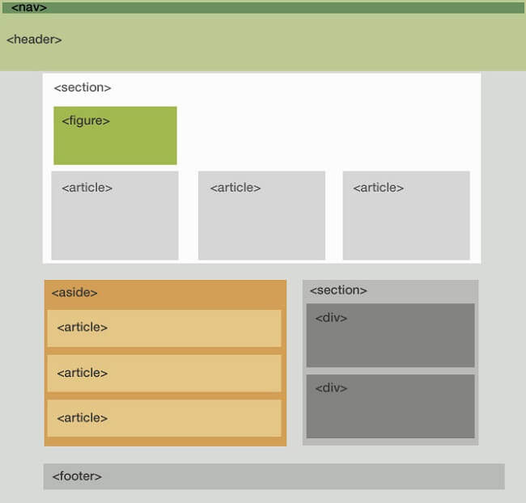

## INTÉGRATION GUIDÉE DE LA PAGE ACCUEIL DU SITE [LE TOURING](letouring.fr)

Dans ce projet, vous devez reproduire la page d'accueil du site letouring.fr à partir de sa maquette située dans le dossier `conception/maquette.jpg`

Votre projet doit fonctionner en hors connexion sur votre machine locale, il est conseillé de télécharger tous les fichiers, librairies, fonts sur votre projet et de les compartimenter dans des dossiers dédiées.

### Listes de compétences mis en œuvre dans ce projet

1. Utiliser les langages de structure HTML5 et CSS3
2. Valider les pages HTML &  CSS
3. Utilisez Git pour versionner votre projet et régler des conflits en local sur votre machine(pour le moment, les instructions sur la création du conflit se feront à l'oral)
4. Télécharger et Intégrer des fonts externes en local.
5. Intégrer un **Carousel/slider** en faisant des recherches sur le web (intégrer uniquement le Html et Css sans se soucier pour le moment de son fonctionnement via Javascript)

### Récupérer le projet via le repository git distant

`git clone https://github.com/glo10/reproduce_letouring.git`

### TACHES

1. Faire un **zoning** sur une feuille papier A4 des futures blocs de la structure HTML de la page en s'inspirant du modèle suivant  en **détaillant davantage** les éléments enfants du header, section et footer que sur ce modèle.

   Vous devez être capable de justifier et argumenter vos choix lors de la validation de ce zoning.

2. Après validation de votre zoning
   
   En local, créer une branche 'dev-html' (dédié au codage de votre page html) à partir de votre branche  'master' 
   Vous devez ajouter votre code HTML dans un fichier nommé  index.html(point d'entrée de votre application) à la racine de ce projet.
   
3. Valider votre code HTML via [Validator W3](https://validator.w3.org/)

   À la fin de l'intégration de votre page HTML, faire un merge request(fusion) de la branche 'dev-html' vers la branche 'master' en local

4. Créer une branche 'dev-css' à partir de la branche master.

5. Récupérer les fonts utilisées sur le site depuis [Downloadfonts](https://www.downloadfonts.io/gotham-font-family-free/) ou [Google fonts](https://fonts.google.com/) .

   Plusieurs fonts sont utilisées sur la page web d'origine, nous n'allons pas nous attarder à les restituer avec exactitude.

   Vous intégrerez les principaux fonts sur les éléments ci-dessous.

   1. Body :  GothamBook
   2. Titres Séjourner, offres , savourer, siroter, évènements : Snell Roundhand
   3. Footer  : Gotham

6. Ajouter votre style dans le fichier css/main.css

7. Valider votre code css via  [Css Validator](http://www.css-validator.org/)

8. Faire un merge request de  votre branche 'dev-css' vers la branche 'master' en local

#### CONSEIL

Pour avoir les couleurs utilisées, vous devez charger le fichier de la maquette sur la page web [Imagecolorpicker](https://imagecolorpicker.com/) , ciblez la zone souhaitée pour obtenir votre couleur en hexadécimal ou RGB.

Vous pouvez intégrer la feuille de style `css/normalize.css` à votre projet pour avoir un rendu similaire sur les différents navigateurs. 

Les navigateurs ajoutent par défaut certains styles comme du margin, padding à vos pages et interprètent de manière différentes vos approximations sur certaines propriétés Css.

Par conséquent, le rendu de votre page diffère d'un navigateur à un autre. Les propriétés définies sur ce fichier permettent d'homogénéiser le rendu final.

L'utilisation du fichier css/normalize.css est recommandée mais non indispensable.

#### EXIGEANCES & RECOMMANDATIONS

1. Les commentaires, les noms de classes, des identifiants doivent être en **anglais**.
2. Utiliser au moins les propriétés **float** pour mettre en style un bloc de votre code html
3. Utiliser au moins la propriété **flex** pour mettre en style un bloc de votre code html
4. Utiliser au moins les propriétés **width**, **margin** pour mettre en style un bloc de votre code html
5. Utiliser le mot-clé **!importan**t sur une valeur d'une propriété  Css pour qu'il prenne le dessus sur les autres valeurs de cette propriété rencontré plus bas dans votre fichier ou hérité du comportement de son ou ses parent(s).
6. Aucun élément HTML de type img, span, p, a, h1,h2...h6 ne doit être un enfant direct du body autrement dit ces éléments doivent avoir un parent de type bloc.
7. Interdiction d'utiliser les outils de développement( devTools) pour pointer les éléments sur la page web du site d'origine.
   Par contre, vous pouvez utiliser la devTools pour ajouter vos propriétés Css depuis le navigateur pour avoir l'aperçu du rendu  finale avant de les intégrer sur votre page Css.
8. Dans la limite du possible, essayez de récupérer les fonts(à placer dans le dossier fonts), librairies, icônes  en local de manière à faire fonctionner votre projet entièrement en local( en hors connexion).

### AIDE

#### CSS

**W3schools**

Utiliser la barre de recherche du site [W3cschools](https://www.w3schools.com/) pour avoir les valeurs possibles d'une propriété et l'aperçu de son rendu sur une structure Html.

**Css Validator**

Service de validation du code Css

[Css-validator](https://jigsaw.w3.org/css-validator/)

#### HTML

Référence des éléments html

[Developper-mozilla](https://developer.mozilla.org/fr/docs/Web/HTML/Element)

Validation du code html

[Validator w3](https://validator.w3.org/)

#### HTML && CSS

Can i use : compatibilité d'une propriété Css ou d'un élément Html sur les différentes versions des navigateurs

[Can i use](https://caniuse.com/)

#### Icônes

Vous pouvez télécharger les icônes

[Flaticon](https://www.flaticon.com/)

#### Images

Télécharger les images

[unsplash](https://unsplash.com/)

#### Fonts

Télécharger une font spéciale

[Google fonts](https://www.google.com/search?client=firefox-b-d&q=googlefonts)

[Download fonts](https://www.downloadfonts.io/)